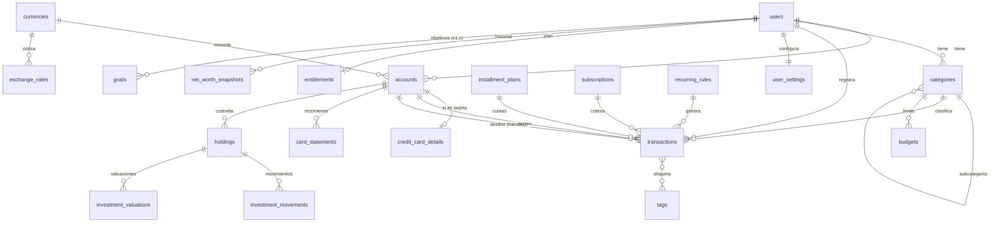
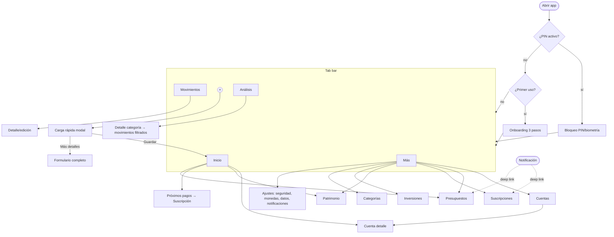

# Finanzas — Análisis de requisitos y arquitectura

> **Estado:** propuesta, pendiente de aprobación. No hay código todavía.
> **Nombre:** "Finanzas" es provisional. Todo el código lo va a leer de un único archivo de configuración (`src/config/app.ts` + `app.config.ts`).
> **Fecha:** 2026-09-29

---

## 0. Observaciones críticas sobre el requerimiento

Antes de la propuesta, estos son los puntos del requerimiento que considero incorrectos, ambiguos o mejorables. Cada uno afecta al modelo de datos, así que conviene resolverlos ahora.

| # | Punto | Problema | Propuesta |
|---|---|---|---|
| 1 | **§7 Patrimonio** | El texto está cortado ("Deudas = Patrimonio neto"). | Supongo `Patrimonio neto = Efectivo + Bancos + Billeteras + Inversiones − Deudas (tarjetas, préstamos, cuotas pendientes)`. |
| 2 | **§5 Distribución** | Mezcla dos dimensiones: *Ocio* es un **gasto**, mientras que *Ahorro* e *Inversiones* **no son gastos**, son dinero que se mueve a otras cuentas. Si se tratan igual, las estadísticas de gasto quedan mal. | Cada categoría de gasto pertenece a un **grupo** (Esenciales, Ocio, Otros, a elección del usuario). *Ahorro* = transferencias netas hacia cuentas marcadas como "ahorro". *Inversión* = transferencias o compras hacia cuentas o activos de inversión. *Sin asignar* = lo que queda. |
| 3 | **Definición de "ahorro"** | "¿Cuánto ahorré?" tiene dos respuestas válidas: (a) **residual**, `ingresos − gastos`; (b) **asignado**, lo que el usuario movió explícitamente a ahorro. | Mostrar las dos: *tasa de ahorro* = residual (el estándar), y en la distribución, ahorro asignado + sin asignar. |
| 4 | **Multimoneda en Argentina** | "Soportar ARS y USD" no alcanza: para sumar patrimonio hace falta un **tipo de cambio**, y en Argentina hay varios (oficial, MEP, CCL, tarjeta, blue). Elegir uno sin decirlo distorsiona el patrimonio. | Cada monto se guarda en su moneda original. Los totales se convierten a una **moneda base** con un **tipo de cambio explícito**: se elige el tipo (MEP por defecto) y se carga a mano en el MVP. La UI siempre muestra qué cotización se usó. |
| 5 | **Inflación** | Con inflación en ARS, "gasté 18% más que el mes pasado" puede ser 0% real. Las comparaciones nominales engañan. | MVP: comparaciones nominales, más la opción de ver montos en USD. v1.x: vista ajustada por inflación (IPC cargado o por API). |
| 6 | **Cuotas** | No está definido cuándo se reconoce el gasto: ¿todo al comprar o cuota por cuota? | Se genera **una transacción por cuota** con la fecha de su resumen, más un `installment_plan` que agrupa todas. Así el presupuesto refleja lo que realmente se paga cada mes (la forma de pensar habitual en Argentina) y las cuotas futuras cuentan como deuda. |
| 7 | **Tarjetas vs MVP** | §9 pide tarjetas completas, pero §27 (MVP) no las incluye. Sin embargo, §3 pide cuotas en el MVP, y las cuotas son casi siempre de tarjeta. | MVP: cuenta de tipo tarjeta con límite, día de cierre, día de vencimiento y "llevás usado X de Y". v1.1: resúmenes con fechas reales, pago del resumen y cuotas con toda su UI. **Decisión pendiente** (§14). |
| 8 | **Tamaño del MVP** | 14 módulos para una sola persona es mucho. El riesgo es tardar meses en poder usarla. | Mantengo los 14, pero en un orden que permite **usar la app a diario desde la Etapa 3** (registrar gastos, cuentas y categorías). El resto se suma encima. |
| 9 | **Exportación como Premium (§23)** | Cobrar por exportar los propios datos genera desconfianza y choca con el derecho a la portabilidad (GDPR y, en espíritu, la Ley 25.326). | Exportar a CSV/JSON y el backup básico: **gratis**. Reportes avanzados (PDF, análisis): Premium. |
| 10 | **Publicidad en una app financiera** | Los anuncios bajan la confianza percibida, el eCPM en LATAM es bajo y los anuncios de "préstamos" o "inversiones" en una app de finanzas son un riesgo reputacional. | Dejar un slot abstracto (`<AdSlot/>`) sin implementar. Si se usa, que sea solo banner en pantallas secundarias o *rewarded* opcional, con categorías de anunciantes filtradas. Nunca en la carga rápida ni en el dashboard. |
| 11 | **IA (§13)** | Casi todos los ejemplos ("gastaste 18% más", "combustible es el 9%", "tasa de ahorro del 22%") son **cálculos deterministas**. Usar un LLM para hacer cuentas es caro, lento y puede inventar números. | **Motor de insights con reglas y SQL** (gratis, offline, exacto). El LLM queda para más adelante y solo para redactar o responder preguntas abiertas, recibiendo **agregados ya calculados**, nunca transacciones crudas. |
| 12 | **Nombre modificable** | El nombre visible se cambia en cualquier momento, pero el **bundle ID / applicationId (`com.x.finanzas`) no se puede cambiar** una vez publicada la app. | El bundle ID se define antes del primer build que se suba a una tienda. Hasta entonces, `com.norberrichi.finanzas.dev`. |

---

## 1. Concepto general

**Finanzas es un centro de control financiero personal *local-first*.** El usuario registra movimientos en segundos y la app los convierte en respuestas: cuánto entró, cuánto salió, a dónde fue, cuánto queda y si su patrimonio crece.

Tres principios de producto:

1. **Registrar primero, completar después.** Un gasto requiere solo *monto* y *categoría*. Lo demás (cuenta, fecha, descripción, etiquetas) tiene valores por defecto inteligentes y se edita después.
2. **Respuestas, no listas.** Cada pantalla responde a una pregunta concreta ("¿Cuánto gasté este mes?", "¿Cuánto me queda?") antes de mostrar datos crudos.
3. **Honestidad numérica.** Moneda original siempre visible, tipo de cambio explícito y nunca números inventados por IA.

**Modelo mental del dinero** (lo que la app distingue siempre):

```
                ┌──────────────┐
  INGRESO ─────▶│   CUENTAS    │─────▶ GASTO (sale del patrimonio)
                │ (ARS / USD)  │
                └──────┬───────┘
                       │ TRANSFERENCIA (no es gasto ni ingreso)
          ┌────────────┼──────────────┬───────────────┐
          ▼            ▼              ▼               ▼
      otra cuenta   AHORRO       INVERSIÓN      PAGO DE DEUDA
                  (cuenta con   (cuenta/activo  (tarjeta/préstamo)
                   propósito    de inversión)
                   "ahorro")
```

- **Ingreso y gasto** cambian el patrimonio.
- **Transferencia**, **ahorro**, **inversión** y **pago de tarjeta** solo mueven dinero entre bolsillos del mismo patrimonio.
- **Compra de dólares** = transferencia ARS→USD con dos montos. No es gasto.

---

## 2. Arquitectura recomendada

### 2.1 Decisión principal: *local-first* con sincronización opcional posterior

| Opción | Ventajas | Desventajas | Veredicto |
|---|---|---|---|
| **Local-first** (SQLite en el teléfono; backend después) | Funciona offline, carga instantánea, cero costo de servidor, privacidad máxima, MVP rápido | La sincronización se agrega después, así que el modelo tiene que estar preparado desde hoy | ✅ **Recomendada** |
| Cloud-first (Firebase/Supabase desde el día 1) | Multiusuario y backup de entrada | Login obligatorio para uso personal, latencia al cargar, costo, más superficie de seguridad, MVP más lento | ❌ para el MVP |

La arquitectura **no es descartable** porque desde el día 1 aplica las reglas que exige la sincronización (§10): IDs globales (UUID v7), `user_id` en cada fila, borrado lógico, `updated_at` y repositorios detrás de interfaces.

### 2.2 Capas

```
┌─────────────────────────────────────────────────────────────┐
│ app/ (Expo Router)       Pantallas y navegación. Delgadas:  │
│                          componen UI y llaman hooks.        │
├─────────────────────────────────────────────────────────────┤
│ features/*/components    UI específica del módulo           │
│ features/*/hooks         useTransactions(), useBudgetStatus │
│                          (queries reactivas + mutaciones)   │
├─────────────────────────────────────────────────────────────┤
│ features/*/services      LÓGICA DE DOMINIO en TS puro:      │
│                          saldos, distribución, presupuestos,│
│                          cuotas, próximo cobro, insights.   │
│                          Sin React y sin SQL → 100% testable│
├─────────────────────────────────────────────────────────────┤
│ features/*/repository    Acceso a datos detrás de interfaz. │
│                          Hoy: Drizzle + SQLite.             │
│                          Mañana: lo mismo + motor de sync.  │
├─────────────────────────────────────────────────────────────┤
│ core/db                  Esquema, migraciones, seed, cifrado│
└─────────────────────────────────────────────────────────────┘
        │  (Fase 2)
        ▼
┌─────────────────────────────────────────────────────────────┐
│ Motor de sync (PowerSync o equivalente) ⇄ Supabase          │
│ Postgres + Auth + RLS · Edge Functions (IA, cotizaciones,   │
│ webhooks de pagos) · Storage (backups cifrados)             │
└─────────────────────────────────────────────────────────────┘
```

**Reglas de dependencia:** `app → features → core`. Un feature no importa internals de otro, solo su `index.ts` público. Los `services` no conocen React ni la base de datos.

### 2.3 Puntos de extensión preparados (interfaces sin implementar)

| Interfaz | MVP | Futuro |
|---|---|---|
| `ExchangeRateProvider` | `ManualRateProvider` (carga manual) | API de cotizaciones (dólar MEP/CCL/oficial) |
| `PriceProvider` (inversiones) | Valuación manual | Brokers, APIs de mercado, cripto |
| `TransactionImporter` | — | CSV bancario, Mercado Pago, OCR de tickets |
| `QuickEntryParser` | Parser local por reglas ("15 mil combustible") | LLM como respaldo |
| `InsightGenerator` | Reglas deterministas | LLM que redacta sobre agregados |
| `EntitlementService` | Todo habilitado (plan `free`, todo desbloqueado) | RevenueCat / tiendas |
| `AdSlot` | Componente vacío | AdMob |
| `SyncAdapter` | No-op | PowerSync / Supabase |
| `BackupTarget` | Archivo local + menú compartir del sistema | Nube cifrada |

---

## 3. Stack tecnológico recomendado

| Capa | Elección | Por qué | Alternativa descartada |
|---|---|---|---|
| Framework | **React Native + Expo (SDK estable más reciente) + TypeScript estricto** | Un código para iOS y Android; builds en la nube (EAS) sin Mac para Android; actualizaciones OTA; camino a web (react-native-web); el mismo lenguaje que el futuro backend (Edge Functions en TS) | **Flutter**: excelente UI, pero Dart no se comparte con backend ni web y el ecosistema de sync local-first es menor. **Nativo**: dos códigos, inviable para una persona. |
| Navegación | **Expo Router** | Rutas por archivos, deep links (útiles para widgets y notificaciones), modales nativos | React Navigation "a mano" (Expo Router ya lo usa por debajo) |
| Base local | **SQLite (`expo-sqlite`) con SQLCipher** | Relacional (las finanzas son relacionales), consultas agregadas rápidas y cifrado en reposo | Realm (deprecado por MongoDB), MMKV/AsyncStorage (no sirven para consultas) |
| ORM / migraciones | **Drizzle ORM + drizzle-kit** | Tipado de extremo a extremo, migraciones versionadas, `useLiveQuery` reactivo, el mismo esquema traducible a Postgres | WatermelonDB (acopla el modelo a su sync), TypeORM (pesado) |
| Estado de UI | **Zustand** (estado efímero: borrador de carga rápida, bloqueo, filtros) | Mínimo y sin boilerplate. El estado de datos vive en SQLite con consultas reactivas | Redux (excesivo) |
| Validación | **Zod** | Un esquema para formularios, importación y futura API | — |
| Formularios | **react-hook-form** (solo formularios largos). La carga rápida usa estado propio | Rendimiento | Formik |
| Gráficos | **victory-native (Skia)** detrás de wrappers propios (`<DonutChart/>`, `<BarChart/>`, `<LineChart/>`) | Rendimiento nativo y animaciones fluidas. Los wrappers permiten cambiar de librería | react-native-gifted-charts (más simple, peor rendimiento con muchos puntos) |
| Animaciones | **react-native-reanimated** + **gesture-handler** | Estándar, corre en el hilo de UI | Animated API |
| Listas | **FlashList** | Miles de movimientos sin lag | FlatList |
| Estilos | **StyleSheet + tokens de diseño tipados** (tema claro/oscuro) | Cero dependencias extra, control total, fácil de migrar | NativeWind (válido, pero suma una capa de build) |
| Iconos | **lucide-react-native** | Set consistente y amplio | Mezclar sets |
| Fechas | **date-fns** + locale `es` | Modular e inmutable | Moment (deprecado) |
| Dinero | **Módulo propio `Money`** sobre enteros (unidades menores) + **big.js** solo para tipos de cambio y cantidades de inversión | Nunca `float` para montos | dinero.js (API inestable) |
| IDs | **UUID v7** | Globalmente únicos (sync) y ordenables por tiempo | Autoincrementales (rompen al sincronizar) |
| Seguridad | **expo-local-authentication** (biometría), **expo-secure-store** (Keychain/Keystore para clave de DB y PIN), **expo-screen-capture** / pantalla de privacidad | Nativos, mantenidos por Expo | — |
| Notificaciones | **expo-notifications** (locales en el MVP) | Sin servidor | — |
| i18n | Textos centralizados en `src/i18n/es-AR.ts` (voseo) con una función `t()` mínima | Permite otros idiomas o mercados después sin reescribir | Hardcodear textos |
| Tests | **Jest + jest-expo**, **@testing-library/react-native**; **Maestro** para E2E (v1.x) | Estándar Expo | Detox (más frágil) |
| Calidad | ESLint + Prettier + `tsc --noEmit` + GitHub Actions | CI desde el día 1 | — |
| **Fase 2** backend | **Supabase** (Postgres, Auth, RLS, Edge Functions, Storage) + **PowerSync** para sync SQLite⇄Postgres | Postgres estándar (sin lock-in fuerte), RLS resuelve multiusuario, sync offline probado | Firebase (NoSQL, peor para reportes y lock-in) |
| **Fase 2** pagos | **RevenueCat** | Abstrae las compras in-app de Apple y Google (obligatorias para suscripciones digitales) | Stripe (no permitido para suscripciones digitales dentro de las apps de tienda) |
| **Fase 2** IA | Claude vía **Edge Function** (proxy; la API key nunca va en la app) | Control de costos, rate limit por plan, privacidad | Llamar al LLM desde el cliente |

> **Incertidumbre explícita:** PowerSync frente a otras opciones de sync (ElectricSQL, sync propio sobre Supabase) conviene reevaluarlo cuando llegue la Fase 2, porque el ecosistema cambia rápido. Lo que sí se decide hoy es el modelo compatible con cualquiera de ellas.

---

## 4. Estructura de carpetas

```
finanzas/
├── app/                          # Rutas (Expo Router). Solo composición.
│   ├── _layout.tsx               # Providers: DB, tema, bloqueo, i18n
│   ├── lock.tsx                  # Pantalla PIN/biometría
│   ├── onboarding/               # Moneda base, primera cuenta, PIN
│   ├── (tabs)/
│   │   ├── _layout.tsx           # Tab bar con botón "+" central
│   │   ├── index.tsx             # Inicio (dashboard)
│   │   ├── movimientos.tsx
│   │   ├── analisis.tsx
│   │   └── mas.tsx
│   ├── movimiento/
│   │   ├── nuevo.tsx             # Modal carga rápida
│   │   └── [id].tsx              # Detalle / edición
│   ├── cuentas/ (index, [id], nueva)
│   ├── presupuestos/
│   ├── suscripciones/
│   ├── patrimonio/
│   ├── inversiones/
│   ├── categorias/
│   └── ajustes/ (index, seguridad, monedas, datos, notificaciones)
├── src/
│   ├── config/
│   │   └── app.ts                # APP_NAME, bundle ids, flags → nombre en UN lugar
│   ├── core/
│   │   ├── db/
│   │   │   ├── client.ts         # Apertura + clave SQLCipher
│   │   │   ├── schema/           # Tablas Drizzle (una por archivo)
│   │   │   ├── migrations/       # Generadas por drizzle-kit
│   │   │   └── seed.ts           # Categorías y monedas por defecto
│   │   ├── money/                # Money, parse/format es-AR, aritmética
│   │   ├── currency/             # Conversión, ExchangeRateProvider
│   │   ├── dates/                # Períodos, rangos, ciclos de tarjeta
│   │   ├── security/             # PIN, biometría, auto-lock, secure-store
│   │   ├── notifications/
│   │   ├── entitlements/         # can('feature'), planes
│   │   ├── schedule/             # Recurrencias (compartido por subs/recurrentes)
│   │   └── ids.ts                # uuidv7
│   ├── features/
│   │   ├── transactions/         # repository.ts · service.ts · hooks.ts · components/ · schema.ts · index.ts
│   │   ├── accounts/
│   │   ├── categories/
│   │   ├── transfers/
│   │   ├── budgets/
│   │   ├── subscriptions/
│   │   ├── recurring/
│   │   ├── cards/                # Tarjetas, cuotas, resúmenes
│   │   ├── investments/
│   │   ├── networth/
│   │   ├── analytics/            # Agregaciones para dashboard y estadísticas
│   │   ├── insights/             # Motor de reglas (luego LLM)
│   │   ├── quick-entry/          # Parser de lenguaje natural
│   │   ├── backup/               # Export/import/borrado total
│   │   └── settings/
│   ├── ui/                       # Design system
│   │   ├── theme/                # tokens: color, spacing, radius, typography
│   │   ├── primitives/           # Text, Card, Button, Sheet, Chip, Amount
│   │   ├── charts/               # Wrappers de gráficos
│   │   └── inputs/               # AmountKeypad, CategoryGrid, DatePill
│   └── i18n/
├── tests/                        # Utilidades y fixtures (los unit tests viven junto al código)
├── docs/
│   ├── ARQUITECTURA.md           # Este documento
│   ├── ROADMAP.md
│   └── adr/                      # Architecture Decision Records
├── app.config.ts                 # Lee nombre e ids desde src/config/app.ts
├── drizzle.config.ts
└── package.json
```

---

## 5. Modelo de base de datos

### 5.1 Convenciones (obligatorias en todas las tablas de usuario)

| Regla | Motivo |
|---|---|
| `id TEXT PRIMARY KEY` con **UUID v7** | Único entre dispositivos → sync sin colisiones |
| `user_id TEXT NOT NULL` | Multiusuario y RLS en Postgres sin migrar datos |
| `created_at`, `updated_at` (ISO-8601 UTC) | Resolución de conflictos (*last-write-wins*) |
| `deleted_at` nullable (**soft delete**) | Un borrado tiene que propagarse por sync; habilita "deshacer" |
| Montos: `*_minor INTEGER` (centavos) + `currency TEXT` | Sin errores de coma flotante. Rango seguro de ±9·10¹³ ARS |
| Fechas de negocio: `occurred_at` (instante UTC) **y** `local_date` (`YYYY-MM-DD`) | Agrupar por día o mes sin que un gasto de las 23:30 caiga en el día siguiente por zona horaria |
| Enums como `TEXT` con `CHECK` | Legibles y migrables a Postgres |
| Tipos de cambio y cantidades como `TEXT` decimal | Precisión exacta (cripto con 8 decimales, cotizaciones) |

### 5.2 Diagrama entidad-relación



### 5.3 Esquema (DDL SQLite, referencia; se implementa con Drizzle)

```sql
-- ───────── Identidad y configuración ─────────
CREATE TABLE users (
  id TEXT PRIMARY KEY,                -- uuid v7; en MVP un único usuario local
  remote_id TEXT UNIQUE,              -- id de Supabase Auth cuando exista login
  display_name TEXT,
  email TEXT,
  base_currency TEXT NOT NULL DEFAULT 'ARS' REFERENCES currencies(code),
  created_at TEXT NOT NULL, updated_at TEXT NOT NULL, deleted_at TEXT
);

CREATE TABLE user_settings (           -- 1:1, preferencias tipadas en JSON validado con Zod
  user_id TEXT PRIMARY KEY REFERENCES users(id),
  data TEXT NOT NULL,                  -- {locale, theme, autoLockSeconds, hideAmounts,
                                       --  defaultAccountId, defaultRateType, notifications:{...}, dashboard:{widgets:[...]}}
  updated_at TEXT NOT NULL
);

CREATE TABLE entitlements (            -- preparado para premium; en MVP: plan='free', todo habilitado
  user_id TEXT PRIMARY KEY REFERENCES users(id),
  plan TEXT NOT NULL DEFAULT 'free' CHECK (plan IN ('free','premium')),
  source TEXT,                         -- 'app_store' | 'play_store' | 'promo'
  expires_at TEXT, updated_at TEXT NOT NULL
);

-- ───────── Monedas ─────────
CREATE TABLE currencies (              -- catálogo; agregar una moneda = insertar una fila
  code TEXT PRIMARY KEY,               -- ISO 4217 ('ARS','USD') o custom ('USDT','BTC')
  name TEXT NOT NULL, symbol TEXT NOT NULL,
  decimals INTEGER NOT NULL DEFAULT 2,
  kind TEXT NOT NULL DEFAULT 'fiat' CHECK (kind IN ('fiat','crypto'))
);

CREATE TABLE exchange_rates (
  id TEXT PRIMARY KEY, user_id TEXT NOT NULL,
  base TEXT NOT NULL, quote TEXT NOT NULL,        -- 1 USD = rate ARS
  rate_type TEXT NOT NULL DEFAULT 'mep',          -- 'oficial'|'mep'|'ccl'|'tarjeta'|'blue'|'custom'
  rate TEXT NOT NULL,                              -- decimal exacto
  rate_date TEXT NOT NULL,                         -- YYYY-MM-DD
  source TEXT NOT NULL DEFAULT 'manual',           -- 'manual' | 'api:<proveedor>'
  created_at TEXT NOT NULL, updated_at TEXT NOT NULL, deleted_at TEXT
);
CREATE INDEX ix_rates_lookup ON exchange_rates(user_id, base, quote, rate_type, rate_date);

-- ───────── Cuentas ─────────
CREATE TABLE accounts (
  id TEXT PRIMARY KEY, user_id TEXT NOT NULL REFERENCES users(id),
  name TEXT NOT NULL,
  type TEXT NOT NULL CHECK (type IN ('cash','bank','savings','wallet','credit_card',
                                     'investment','loan','other')),
  purpose TEXT NOT NULL DEFAULT 'spending'        -- define "ahorro"/"inversión" en la distribución
       CHECK (purpose IN ('spending','savings','investment','debt')),
  currency TEXT NOT NULL REFERENCES currencies(code),   -- moneda principal
  initial_balance_minor INTEGER NOT NULL DEFAULT 0,
  initial_balance_date TEXT NOT NULL,
  institution TEXT,                    -- "Galicia", "Mercado Pago" (texto libre, sin datos sensibles)
  include_in_net_worth INTEGER NOT NULL DEFAULT 1,
  color TEXT, icon TEXT, sort_order INTEGER NOT NULL DEFAULT 0,
  archived_at TEXT,
  created_at TEXT NOT NULL, updated_at TEXT NOT NULL, deleted_at TEXT
);

CREATE TABLE credit_card_details (     -- 1:1 con accounts donde type='credit_card'
  account_id TEXT PRIMARY KEY REFERENCES accounts(id),
  credit_limit_minor INTEGER,          -- en moneda de la cuenta (ARS)
  closing_day INTEGER CHECK (closing_day BETWEEN 1 AND 31),
  due_day INTEGER CHECK (due_day BETWEEN 1 AND 31),
  last_four TEXT CHECK (length(last_four) = 4),  -- opcional; NUNCA número completo, CVV ni vencimiento
  network TEXT,                        -- 'visa'|'mastercard'|'amex'...
  updated_at TEXT NOT NULL
);

CREATE TABLE card_statements (         -- v1.1: resúmenes con fechas reales (los bancos las mueven)
  id TEXT PRIMARY KEY, user_id TEXT NOT NULL, account_id TEXT NOT NULL REFERENCES accounts(id),
  period_start TEXT NOT NULL, closing_date TEXT NOT NULL, due_date TEXT NOT NULL,
  status TEXT NOT NULL DEFAULT 'open' CHECK (status IN ('open','closed','paid','partial')),
  created_at TEXT NOT NULL, updated_at TEXT NOT NULL, deleted_at TEXT
);

-- ───────── Categorías y etiquetas ─────────
CREATE TABLE categories (
  id TEXT PRIMARY KEY, user_id TEXT NOT NULL,
  parent_id TEXT REFERENCES categories(id),      -- NULL = categoría; no-NULL = subcategoría (máx. 2 niveles)
  kind TEXT NOT NULL CHECK (kind IN ('expense','income')),
  name TEXT NOT NULL,
  spending_group TEXT                            -- solo gastos: 'essential'|'leisure'|'other' → distribución §5
       CHECK (spending_group IN ('essential','leisure','other')),
  icon TEXT NOT NULL, color TEXT NOT NULL,
  system_key TEXT,                               -- 'food','fuel'... para parser/insights aunque el usuario la renombre
  sort_order INTEGER NOT NULL DEFAULT 0, archived_at TEXT,
  created_at TEXT NOT NULL, updated_at TEXT NOT NULL, deleted_at TEXT
);

CREATE TABLE tags (
  id TEXT PRIMARY KEY, user_id TEXT NOT NULL, name TEXT NOT NULL,
  created_at TEXT NOT NULL, updated_at TEXT NOT NULL, deleted_at TEXT
);
CREATE TABLE transaction_tags (
  transaction_id TEXT NOT NULL REFERENCES transactions(id),
  tag_id TEXT NOT NULL REFERENCES tags(id),
  PRIMARY KEY (transaction_id, tag_id)
);

-- ───────── Movimientos (tabla central) ─────────
CREATE TABLE transactions (
  id TEXT PRIMARY KEY, user_id TEXT NOT NULL,
  type TEXT NOT NULL CHECK (type IN ('expense','income','transfer','adjustment')),
  status TEXT NOT NULL DEFAULT 'posted'
       CHECK (status IN ('posted','pending','scheduled')),  -- scheduled = cuota/suscripción futura
  account_id TEXT NOT NULL REFERENCES accounts(id),         -- origen (gasto/transfer) o destino (ingreso)
  amount_minor INTEGER NOT NULL CHECK (amount_minor > 0),   -- siempre positivo; el signo lo da el type
  currency TEXT NOT NULL REFERENCES currencies(code),
  -- Transferencias (incluye compra/venta de dólares con dos montos):
  to_account_id TEXT REFERENCES accounts(id),
  to_amount_minor INTEGER,
  to_currency TEXT REFERENCES currencies(code),
  -- Clasificación:
  category_id TEXT REFERENCES categories(id),               -- NULL permitido: "sin categorizar" (registrar primero)
  description TEXT,
  payee TEXT,                                               -- comercio/fuente ("McDonald's", "Empresa X")
  payment_method TEXT,                                      -- 'cash'|'debit'|'credit'|'transfer'|'qr' (inferible de la cuenta)
  -- Tiempo:
  occurred_at TEXT NOT NULL,                                -- instante UTC
  local_date TEXT NOT NULL,                                 -- YYYY-MM-DD en zona del usuario (agrupación)
  -- Orígenes/vínculos:
  installment_plan_id TEXT REFERENCES installment_plans(id),
  installment_number INTEGER,
  subscription_id TEXT REFERENCES subscriptions(id),
  recurring_rule_id TEXT REFERENCES recurring_rules(id),
  statement_id TEXT REFERENCES card_statements(id),
  source TEXT NOT NULL DEFAULT 'manual',                    -- 'manual'|'quick'|'nlp'|'recurring'|'import'|'ocr'
  notes TEXT,
  created_at TEXT NOT NULL, updated_at TEXT NOT NULL, deleted_at TEXT,
  CHECK ( (type = 'transfer') = (to_account_id IS NOT NULL) ),
  CHECK ( type <> 'transfer' OR category_id IS NULL )       -- una transferencia nunca es gasto
);
CREATE INDEX ix_tx_user_date     ON transactions(user_id, local_date) WHERE deleted_at IS NULL;
CREATE INDEX ix_tx_account_date  ON transactions(account_id, local_date);
CREATE INDEX ix_tx_to_account    ON transactions(to_account_id) WHERE to_account_id IS NOT NULL;
CREATE INDEX ix_tx_category_date ON transactions(category_id, local_date);

-- ───────── Cuotas, recurrencias y suscripciones ─────────
CREATE TABLE installment_plans (
  id TEXT PRIMARY KEY, user_id TEXT NOT NULL,
  account_id TEXT NOT NULL REFERENCES accounts(id),
  category_id TEXT REFERENCES categories(id),
  description TEXT,
  total_amount_minor INTEGER NOT NULL, currency TEXT NOT NULL,
  installments_count INTEGER NOT NULL CHECK (installments_count >= 1),
  first_installment_date TEXT NOT NULL,
  purchase_date TEXT NOT NULL,
  created_at TEXT NOT NULL, updated_at TEXT NOT NULL, deleted_at TEXT
);

CREATE TABLE recurring_rules (         -- gastos/ingresos recurrentes genéricos (sueldo, alquiler)
  id TEXT PRIMARY KEY, user_id TEXT NOT NULL,
  template TEXT NOT NULL,              -- JSON de la transacción a generar (type, account, amount, category...)
  frequency TEXT NOT NULL CHECK (frequency IN ('daily','weekly','monthly','yearly')),
  interval INTEGER NOT NULL DEFAULT 1,
  anchor_day INTEGER,                  -- día del mes/semana
  start_date TEXT NOT NULL, end_date TEXT,
  next_occurrence TEXT NOT NULL,
  mode TEXT NOT NULL DEFAULT 'confirm' CHECK (mode IN ('auto','confirm')),
  active INTEGER NOT NULL DEFAULT 1,
  created_at TEXT NOT NULL, updated_at TEXT NOT NULL, deleted_at TEXT
);

CREATE TABLE subscriptions (
  id TEXT PRIMARY KEY, user_id TEXT NOT NULL,
  name TEXT NOT NULL,
  amount_minor INTEGER NOT NULL, currency TEXT NOT NULL,
  frequency TEXT NOT NULL CHECK (frequency IN ('weekly','monthly','quarterly','yearly')),
  interval INTEGER NOT NULL DEFAULT 1,
  next_charge_date TEXT NOT NULL,
  category_id TEXT REFERENCES categories(id),
  account_id TEXT REFERENCES accounts(id),
  status TEXT NOT NULL DEFAULT 'active' CHECK (status IN ('active','paused','cancelled')),
  remind_days_before INTEGER DEFAULT 1,
  mode TEXT NOT NULL DEFAULT 'confirm' CHECK (mode IN ('auto','confirm')),
  started_at TEXT, notes TEXT,
  created_at TEXT NOT NULL, updated_at TEXT NOT NULL, deleted_at TEXT
);

-- ───────── Presupuestos ─────────
CREATE TABLE budgets (
  id TEXT PRIMARY KEY, user_id TEXT NOT NULL,
  category_id TEXT REFERENCES categories(id),    -- NULL = presupuesto global del mes
  period TEXT NOT NULL DEFAULT 'monthly' CHECK (period IN ('monthly')),  -- extensible a weekly/yearly
  amount_minor INTEGER NOT NULL, currency TEXT NOT NULL,
  alert_thresholds TEXT NOT NULL DEFAULT '[80,100]',
  valid_from TEXT NOT NULL,            -- YYYY-MM; un cambio de monto crea una fila nueva → historial correcto
  valid_to TEXT,
  rollover INTEGER NOT NULL DEFAULT 0, -- Premium futuro
  created_at TEXT NOT NULL, updated_at TEXT NOT NULL, deleted_at TEXT
);

-- ───────── Inversiones ─────────
CREATE TABLE holdings (                -- una posición: "AAPL CEDEAR", "Plazo fijo Galicia", "BTC"
  id TEXT PRIMARY KEY, user_id TEXT NOT NULL,
  account_id TEXT REFERENCES accounts(id),       -- cuenta de inversión/broker (opcional)
  asset_type TEXT NOT NULL CHECK (asset_type IN ('stock','cedear','bond','fund','crypto',
                                                 'fixed_term','fx','other')),
  name TEXT NOT NULL, symbol TEXT,               -- symbol permite conectar PriceProvider después
  currency TEXT NOT NULL,
  maturity_date TEXT, rate_pct TEXT,             -- plazos fijos/bonos
  status TEXT NOT NULL DEFAULT 'open' CHECK (status IN ('open','closed')),
  created_at TEXT NOT NULL, updated_at TEXT NOT NULL, deleted_at TEXT
);

CREATE TABLE investment_movements (    -- capital invertido = Σ compras − Σ ventas (costo)
  id TEXT PRIMARY KEY, user_id TEXT NOT NULL,
  holding_id TEXT NOT NULL REFERENCES holdings(id),
  type TEXT NOT NULL CHECK (type IN ('buy','sell','dividend','interest','fee')),
  movement_date TEXT NOT NULL,
  quantity TEXT,                       -- decimal; opcional en carga simple
  amount_minor INTEGER NOT NULL, currency TEXT NOT NULL,
  linked_transaction_id TEXT REFERENCES transactions(id),  -- si salió de una cuenta propia
  created_at TEXT NOT NULL, updated_at TEXT NOT NULL, deleted_at TEXT
);

CREATE TABLE investment_valuations (   -- "valor actual" con historial → evolución de inversiones
  id TEXT PRIMARY KEY, user_id TEXT NOT NULL,
  holding_id TEXT NOT NULL REFERENCES holdings(id),
  valuation_date TEXT NOT NULL,
  value_minor INTEGER NOT NULL, currency TEXT NOT NULL,
  unit_price TEXT,
  source TEXT NOT NULL DEFAULT 'manual',
  created_at TEXT NOT NULL, updated_at TEXT NOT NULL, deleted_at TEXT
);

-- ───────── Patrimonio ─────────
CREATE TABLE net_worth_snapshots (     -- foto mensual; permite historial aunque cambien valuaciones o tipos de cambio
  id TEXT PRIMARY KEY, user_id TEXT NOT NULL,
  snapshot_date TEXT NOT NULL,         -- último día del mes (o manual)
  base_currency TEXT NOT NULL,
  assets_minor INTEGER NOT NULL, liabilities_minor INTEGER NOT NULL, net_minor INTEGER NOT NULL,
  rate_type TEXT, rate TEXT,           -- cotización usada (transparencia)
  breakdown TEXT NOT NULL,             -- JSON por cuenta/tipo/moneda
  created_at TEXT NOT NULL, updated_at TEXT NOT NULL, deleted_at TEXT,
  UNIQUE (user_id, snapshot_date)
);

-- ───────── v1.x (definidas, no implementadas en el MVP) ─────────
-- goals(id, user_id, name, target_minor, currency, target_date, linked_account_id, ...)
-- insights(id, user_id, kind, period, payload JSON, severity, seen_at, dismissed_at, ...)
-- category_rules(id, user_id, match TEXT, category_id)   -- autocategorización por comercio
-- households / household_members                          -- finanzas compartidas (v3)
```

### 5.4 Reglas de negocio clave

**Saldos.** Se calculan, no se guardan. Con volúmenes personales (decenas de miles de filas), `SUM` indexado responde en milisegundos. Si hiciera falta, se agrega una caché con snapshots.

```
saldo(cuenta, moneda) = saldo_inicial
  + Σ ingresos − Σ gastos                          (account_id = cuenta)
  − Σ transfer.amount    (account_id = cuenta)
  + Σ transfer.to_amount (to_account_id = cuenta)
  ± ajustes
  (solo status='posted' y deleted_at IS NULL)
```

- **Saldo por moneda:** una tarjeta argentina tiene consumos en ARS y en USD. La transacción puede tener una moneda distinta a la de la cuenta **solo en tarjetas**, y el saldo se agrupa por moneda. En las demás cuentas, moneda de transacción = moneda de cuenta, validado en el servicio.
- **Tarjeta de crédito:** su saldo es negativo (deuda). Un gasto con tarjeta aumenta la deuda y el pago del resumen es una **transferencia** banco→tarjeta. Así no se cuenta el gasto dos veces, que es el error más común en este tipo de apps.
- **Compra de USD:** `transfer` con `amount_minor=100000000 ARS` y `to_amount_minor=10000000 USD` (valores en unidades menores). El tipo de cambio implícito queda registrado.
- **Distribución del mes (§5 del requerimiento):**
  - `Ingresos` = Σ income
  - `Gastos por grupo` = Σ expense agrupado por `category.spending_group`
  - `Ahorro` = Σ transfers netas hacia cuentas `purpose='savings'`
  - `Inversión` = Σ transfers netas hacia `purpose='investment'` + compras de holdings pagadas desde cuentas propias
  - `Sin asignar` = Ingresos − (Gastos + Ahorro + Inversión). Si es negativo, se muestra la alerta "gastaste más de lo que ingresó".
  - Todo convertido a la moneda base con la cotización del período, y porcentajes sobre ingresos.
- **Patrimonio neto** = Σ saldos de cuentas con `include_in_net_worth` + Σ última valuación de holdings abiertos − Σ deudas (saldo de tarjetas + cuotas `scheduled` futuras + préstamos), convertido a moneda base.
- **Cuotas:** al guardar una compra en N cuotas se crean el `installment_plan` y N transacciones. La primera queda `posted` y las siguientes `scheduled`, con `local_date` en su período. Pasan a `posted` al llegar su fecha.
- **Suscripciones y recurrentes:** se materializan **al abrir la app** (en iOS no hay ejecución en segundo plano confiable). El modo `confirm` genera un movimiento pendiente de confirmación y el modo `auto` lo crea directamente. Las notificaciones se programan localmente con anticipación.
- **Presupuestos:** `gastado = Σ expense del mes en la categoría y sus subcategorías`. Alertas al cruzar cada umbral, una sola vez por umbral y mes.

---

## 6. Principales pantallas

| Pantalla | Responde a | Contenido |
|---|---|---|
| **Onboarding** (3 pasos, salteable) | — | Moneda base y cotización USD inicial → primera cuenta ("Efectivo" pre-creada) → PIN/biometría |
| **Bloqueo** | — | PIN numérico + biometría automática |
| **Inicio (Dashboard)** | ¿Cómo estoy este mes? | 1) Saldo total disponible (con toggle 👁 ocultar montos). 2) Fila de KPIs: Ingresos · Gastos · Ahorro (tasa %) · Inversiones · Patrimonio neto. 3) Donut de distribución del dinero. 4) Top 5 categorías de gasto con barras. 5) Últimos 5 movimientos. 6) Próximos pagos (suscripciones, cuotas, vencimiento de tarjeta). Widgets ordenables en v1.x. |
| **Carga rápida** (modal/bottom sheet) | Registrar en 3 toques | Teclado numérico grande con foco inmediato, segmento Gasto/Ingreso/Transferencia, grilla de las 8 categorías más usadas, cuenta por defecto (la última usada), fecha "Hoy" editable con un toque, descripción opcional, "Guardar" y "Guardar y otro". "Más detalles" despliega cuotas, etiquetas, hora y notas. |
| **Movimientos** | ¿Qué pasó? | Lista agrupada por día con subtotal diario, búsqueda, filtros (tipo, cuenta, categoría, moneda, etiqueta, rango) y swipe para editar o borrar con deshacer |
| **Detalle de movimiento** | — | Edición completa y vínculos (cuota 3/6, suscripción de origen) |
| **Análisis** | ¿En qué gasto y cómo evoluciono? | Selector de período (día/semana/mes/año/personalizado), totales, promedio diario y mensual, gasto por categoría (donut + ranking), evolución (barras), ingresos vs gastos, comparación con el período anterior (Δ absoluto y %), toggle ARS/USD |
| **Cuentas** | ¿Dónde está mi plata? | Lista agrupada por tipo con saldo por moneda y total convertido. Detalle: saldo, movimientos y gráfico de evolución. Tarjeta: "Llevás usado $350.000 de $1.000.000" y "Próximo resumen estimado" |
| **Transferencia** | — | Origen → destino. Si las monedas difieren, pide dos montos y muestra el tipo de cambio implícito |
| **Presupuestos** | ¿Me estoy pasando? | Tarjetas por categoría con barra de progreso (verde < 80% ≤ ámbar < 100% ≤ rojo) y "te quedan $X para N días" |
| **Suscripciones** | ¿Cuánto me cuestan? | Total mensual equivalente, total anual, % de los ingresos, lista ordenada por próximo cobro, pausar o cancelar |
| **Patrimonio** | ¿Crece mi patrimonio? | Neto actual, activos vs pasivos, gráfico de líneas mensual, Δ absoluto y % vs mes anterior, desglose por tipo y moneda |
| **Inversiones** | ¿Cómo rinden? | Capital invertido, valor actual, ganancia/pérdida ($ y %) por posición y total, "actualizar valor" en 1 toque |
| **Categorías** | — | Árbol editable: crear, renombrar, icono y color, grupo, archivar (nunca borrar si tiene movimientos) |
| **Más / Ajustes** | — | Cuentas, Presupuestos, Suscripciones, Patrimonio, Inversiones, Categorías · Monedas y cotizaciones · Seguridad · Notificaciones · Datos (exportar, backup, restaurar, borrar todo) · Acerca de |

**Lineamientos visuales:** una tipografía (Inter o la del sistema) con números **tabulares** para montos; escala de espaciado de 4 pt; tarjetas con radio de 16; paleta neutra con un solo color de acento; verde e rojo solo para semántica (ingreso/gasto, dentro/fuera de presupuesto) y nunca como único indicador (accesibilidad); modo oscuro desde el día 1; microanimaciones de 150–250 ms (entrada de tarjetas, check al guardar, háptica al registrar).

---

## 7. Flujo de navegación



Tab bar: **Inicio · Movimientos · ( + ) · Análisis · Más**. El "+" está siempre visible y centrado. Patrimonio no tiene tab propio en el MVP (se llega desde el KPI del dashboard y desde Más). Si el uso muestra que es importante, se le da tab propio.

---

## 8. Funcionalidades del MVP

Criterio de "hecho" para cada módulo: funciona offline, persiste entre reinicios, tiene tests del servicio de dominio y se probó en un teléfono real.

| # | Módulo | Alcance MVP | Fuera del MVP |
|---|---|---|---|
| 1 | Dashboard | Bloques fijos de §6 | Widgets personalizables |
| 2 | Ingresos | Alta/edición/borrado, fuente (payee), categoría, cuenta destino, recurrente | — |
| 3 | Gastos | Carga rápida (≤ 3 toques) + formulario completo con todos los campos de §3, cuotas básicas | NLP, OCR |
| 4 | Categorías | Seed por defecto (gastos e ingresos de §3/§4), CRUD, subcategorías, grupos | Autocategorización |
| 5 | Cuentas | Todos los tipos de §8, saldo por moneda, historial, archivar | Conexión bancaria |
| 6 | Transferencias | Entre cuentas, con conversión de moneda | — |
| 7 | Presupuestos | Mensual por categoría, umbrales 80/100 con aviso | Rollover, semanal, por etiqueta |
| 8 | Estadísticas | Períodos, totales, promedios, top categorías, comparación con período anterior | Proyecciones |
| 9 | Gráficos | Donut categorías/distribución, barras evolución, ingresos vs gastos, línea patrimonio, presupuesto vs gasto | Gráficos interactivos avanzados |
| 10 | Suscripciones | CRUD, próximo cobro, total mensual/anual, % de ingresos, recordatorio local | Detección automática desde movimientos |
| 11 | Patrimonio básico | Neto actual, snapshots mensuales, evolución y variación | Proyección |
| 12 | Configuración | Moneda base, cotizaciones manuales, tema, PIN/biometría, auto-lock, ocultar montos, notificaciones on/off, exportar CSV/JSON, backup/restore, borrar todo | Cuenta en la nube |
| 13 | ARS/USD | Moneda por cuenta y movimiento, conversión con cotización explícita | Cotización automática |
| 14 | Persistencia | SQLite cifrado + migraciones versionadas | Sync |
| + | Inversiones (manual) | Posiciones, compras/ventas, valuación manual, G/P | APIs de precios |
| + | Tarjeta básica | Límite, cierre y vencimiento, uso actual, estimación del próximo resumen | Resúmenes reales, conciliación |

---

## 9. Funcionalidades para versiones posteriores

**v1.1: "uso diario pulido"** (solo local)
- Tarjetas completas: resúmenes con fechas reales, pago del resumen y conciliación, cuotas con vista de "cuotas pendientes".
- Carga por lenguaje natural con parser local ("hoy gasté 15 mil en combustible", "ayer 8500 mc donalds con débito").
- Motor de insights deterministas (todos los ejemplos de §13).
- Objetivos y metas de ahorro (§25).
- Dashboard personalizable.
- Vista ajustada por inflación y vista en USD.
- Deudas y préstamos como entidad con cronograma.
- Reglas de autocategorización por comercio.
- Widgets de inicio y atajos (Android App Shortcuts / iOS App Intents): "+ gasto" desde la pantalla principal.

**v2: "producto"** (backend)
- Cuenta de usuario (email, Apple y Google Sign-In), obligatoria solo para sync.
- Sincronización entre dispositivos y backup en la nube cifrado.
- Plan Premium (RevenueCat) y feature gating real.
- IA con LLM: resumen mensual redactado y preguntas abiertas sobre los datos (sobre agregados).
- Cotizaciones automáticas (dólar oficial, MEP, CCL) y precios de activos.
- Importación de CSV/Excel bancario y de Mercado Pago.
- Publicación en Google Play y App Store.

**v3: "expansión"**
- OCR de tickets con la cámara e importación de comprobantes.
- Integración con Mercado Pago, bancos y brokers (según disponibilidad de APIs; en Argentina el *open banking* todavía es limitado, **no tengo certeza** de la oferta real de APIs en 2026–27).
- App web (react-native-web o Next.js sobre el mismo backend).
- Finanzas compartidas con pareja o familia (households con roles).
- Proyecciones financieras y escenarios.
- Comandos por voz.
- Otros mercados: más monedas e idiomas.

---

## 10. Estrategia de escalabilidad

### 10.1 Qué se hace desde el día 1 (costo bajo, evita reescritura)
1. **UUID v7, `user_id`, `updated_at` y `deleted_at` en todas las tablas** → compatible con sync y multiusuario sin migrar datos.
2. **Repositorios detrás de interfaces** → cambiar a un motor de sync no toca UI ni servicios.
3. **Lógica de dominio en TS puro** → reutilizable en backend (Edge Functions), web y tests.
4. **Esquema Drizzle portable a Postgres** → la migración a Supabase es casi mecánica.
5. **Entitlements y `can(feature)`** en los puntos donde después habrá Premium, siempre devolviendo `true` en el MVP.
6. **Configuración por usuario en `user_settings`**, nunca constantes globales.
7. **Textos centralizados** → i18n.
8. **Nombre e ids en `src/config/app.ts`** → white-label o renombrado trivial.
9. **Migraciones versionadas y testeadas** → nunca romper datos de usuarios reales.
10. **CI** (typecheck + lint + tests) en cada push.

### 10.2 Qué NO se hace todavía (evita complejidad prematura)
- Backend, login y sync.
- Pagos, anuncios y analytics de producto.
- Microservicios o GraphQL (Supabase + Edge Functions alcanza hasta cientos de miles de usuarios).
- Cachés de saldos (hasta que una medición lo justifique).

### 10.3 Camino a multiusuario (Fase 2)
1. Crear proyecto Supabase con el mismo esquema y **RLS `user_id = auth.uid()`** en cada tabla.
2. Al primer login: `users.remote_id = auth.uid()` y reescribir el `user_id` local (una sola vez).
3. Activar el motor de sync (las filas ya tienen todo lo que necesita).
4. Conflictos: *last-write-wins* por fila con `updated_at`. Las finanzas personales casi no tienen edición concurrente real y los montos nunca se "mergean".
5. Backup en la nube = consecuencia del sync. El backup local cifrado se mantiene para quien no quiera cuenta.

---

## 11. Posibles modelos de monetización

| Modelo | Encaje | Comentario |
|---|---|---|
| **Freemium + suscripción Premium** (mensual/anual) | ✅ Principal | Precio localizado por país (en Argentina, precio en ARS de la tienda). El anual con descuento fuerte mejora la retención |
| **Compra única "de por vida"** | ✅ Complemento | Atrae a usuarios reacios a suscripciones. Limitarla a las funciones locales, porque la nube y la IA tienen costo recurrente |
| **Publicidad discreta** | ⚠️ Secundario | Solo en la versión gratuita, fuera de los flujos críticos, con categorías filtradas. Se desactiva con Premium |
| **Rewarded ads** | ⚠️ Opcional | "Mirá un anuncio para generar este reporte". Menos invasivo que un banner |
| **Afiliados** (brokers, cuentas remuneradas) | ❌ Por ahora | Conflicto de interés con la regla "la IA no recomienda inversiones" y posible regulación (CNV). Reevaluar con asesoramiento legal |
| **B2B / white-label** | Futuro | Posible gracias a la configuración centralizada |

**Propuesta de corte Free/Premium** (ajustada respecto de §23):

| Free | Premium |
|---|---|
| Ingresos, gastos y transferencias ilimitados | IA: resumen mensual, preguntas abiertas |
| Hasta 4 cuentas y 2 monedas | Cuentas ilimitadas, más monedas |
| Categorías, 3 presupuestos | Presupuestos ilimitados, rollover, alertas avanzadas |
| Dashboard y estadísticas del mes actual y anterior | Historial completo, comparaciones, vista por inflación |
| Suscripciones | Inversiones avanzadas y cotizaciones automáticas |
| Patrimonio actual | Evolución histórica del patrimonio, proyecciones |
| **Exportación CSV y backup local** | Reportes PDF, sync entre dispositivos, backup en nube |
| Insights básicos por reglas | Objetivos ilimitados, automatizaciones, importación bancaria |

---

## 12. Riesgos técnicos

| # | Riesgo | Prob. | Impacto | Mitigación |
|---|---|---|---|---|
| 1 | **Pérdida de datos** (teléfono perdido o roto, sin nube en el MVP) | Media | **Crítico** | Backup cifrado exportable desde la Etapa 7, recordatorio periódico de backup y restauración probada con tests |
| 2 | **Pérdida de la clave de cifrado** (reinstalación, restauración de Keychain) | Baja | Crítico | Backup exportado con contraseña propia (independiente de la clave de DB) y tests de restauración |
| 3 | **Ambigüedad de tipo de cambio** → patrimonio "incorrecto" | Alta | Alto | Cotización explícita con tipo y fecha, siempre visible, y montos guardados en moneda original |
| 4 | **Inflación** distorsiona comparaciones | Alta | Medio | Etiqueta "nominal" y vistas USD e IPC en v1.1 |
| 5 | **Doble conteo** (gasto con tarjeta + pago del resumen) | Alta si se modela mal | Alto | Pago de resumen = transferencia (regla de dominio con test) |
| 6 | **Tareas en segundo plano** poco confiables (iOS) | Alta | Medio | Materializar recurrencias al abrir la app y notificaciones locales pre-programadas |
| 7 | **Ciclos de tarjeta reales** (cierres que cambian, consumos USD, percepciones impositivas cambiantes) | Alta | Medio | MVP: estimación con días fijos editables. v1.1: resúmenes con fechas reales. No modelar impuestos hasta tener certeza de la normativa vigente |
| 8 | **Conflictos de sync** en Fase 2 | Media | Alto | Diseño preparado desde hoy + motor de sync probado en lugar de uno propio |
| 9 | **SQLCipher requiere *development build*** (no funciona en Expo Go) | Cierta | Bajo | Etapas 0–6 con SQLite plano en Expo Go para iterar rápido y cifrado en la Etapa 7 con EAS dev build |
| 10 | **Políticas de tiendas**: pagos in-app obligatorios, borrado de cuenta dentro de la app, etiquetas de privacidad, políticas de apps financieras | Cierta en Fase 2 | Alto | RevenueCat, "borrar todo" ya en el MVP y política de privacidad antes de publicar |
| 11 | **Regulación**: la IA no debe parecer asesoramiento financiero (CNV) y los datos personales están sujetos a la Ley 25.326 (y GDPR si hay usuarios UE) | Media | Alto | Disclaimers, prompts restringidos a análisis descriptivo, datos mínimos y consulta legal antes del lanzamiento comercial |
| 12 | **Costo y privacidad del LLM** | Media | Medio | Enviar solo agregados, proxy con rate limit por plan, caché de resúmenes mensuales, reglas deterministas primero |
| 13 | **Scope creep** (el requerimiento es enorme) | **Alta** | Alto | Etapas cerradas con "definición de hecho" y cambios de alcance anotados en `ROADMAP.md`, no en la etapa en curso |
| 14 | **Probar en teléfono desde este entorno** | Cierta | Medio | Yo no puedo ejecutar la app en tu teléfono desde la nube. Puedo correr typecheck, tests y el bundle. La prueba en dispositivo la hacés vos con Expo Go (Etapas 0–6) o un APK de EAS Build (Etapa 7+) |

---

## 13. Plan de desarrollo por etapas

Cada etapa termina con: typecheck, lint y tests en verde, commit y push, instrucciones para probar en el teléfono y tu validación antes de pasar a la siguiente.

| Etapa | Objetivo | Entregable verificable |
|---|---|---|
| **0. Fundaciones** | Proyecto Expo + TS estricto, ESLint/Prettier, Jest, CI en GitHub Actions, estructura de carpetas, `config/app.ts`, tema y tokens, pantalla "hola" con tabs vacíos | Abre en tu teléfono con Expo Go y la CI queda verde |
| **1. Núcleo de dominio y datos** | `Money` (parse/format es-AR, aritmética entera), monedas, fechas y períodos, esquema Drizzle completo del MVP, migraciones, seed de categorías, repositorios | Tests unitarios de dinero, saldos, transferencias con conversión y distribución. La DB se crea y migra en el dispositivo |
| **2. Navegación y design system** | Tab bar con "+", rutas, primitivas UI (Card, Amount, Sheet, Keypad, CategoryGrid), modo oscuro | Navegación completa con pantallas esqueleto |
| **3. Registro (primer uso real)** | Carga rápida, formulario completo, lista de movimientos, edición, borrado con deshacer, cuentas, transferencias, categorías CRUD | **Podés empezar a usarla a diario.** Registrar un gasto toma 3 toques |
| **4. Dashboard, estadísticas y gráficos** | Servicios de analytics, dashboard, pantalla Análisis, comparaciones, wrappers de gráficos | Responde a las preguntas de §1 del requerimiento con tus datos reales |
| **5. Presupuestos, suscripciones y recurrentes** | CRUD, cálculo de progreso, materialización al abrir la app, notificaciones locales con on/off | Alerta al 80% y recordatorio de cobro funcionando en el dispositivo |
| **6. Patrimonio, inversiones y tarjeta básica** | Cotizaciones manuales, holdings/valuaciones, snapshots mensuales, uso de tarjeta y cuotas básicas | Patrimonio neto correcto en ARS/USD con evolución mensual |
| **7. Seguridad y datos** | PIN + biometría, auto-lock, pantalla de privacidad, ocultar montos, SQLCipher, export CSV/JSON, backup cifrado y restauración, borrar todo. Primer **EAS development build** | Instalable (APK en Android / dev build en iOS). Backup → borrar → restaurar sin pérdida |
| **8. Endurecimiento** | Seed de 10.000 movimientos para medir rendimiento, revisión de accesibilidad, corrección de bugs, 2–4 semanas de uso propio | Checklist de calidad cumplida → **MVP cerrado** |
| **9+** | v1.1 → v2 según §9, priorizando lo que muestre tu uso real | — |

---

## 14. Decisiones pendientes (necesito tu confirmación)

1. **¿Tu teléfono es Android o iPhone?** Define cómo probás las builds con cifrado: en Android un APK de EAS alcanza (gratis); en iPhone, un dev build en dispositivo requiere cuenta Apple Developer (USD 99/año). Expo Go sirve en ambos para las Etapas 0–6.
2. **Stack:** ¿aprobás React Native + Expo + SQLite/Drizzle, local-first, sin login en el MVP?
3. **Tarjetas y cuotas:** ¿alcanza con la versión básica en el MVP (Etapa 6) y resúmenes reales en v1.1, o las cuotas con tarjeta son centrales para tu uso diario y las adelanto?
4. **Tipo de cambio por defecto** para convertir USD→ARS en patrimonio y totales: ¿MEP, oficial u otro? En el MVP se carga a mano.
5. **Ahorro:** ¿te sirve la propuesta de mostrar la *tasa de ahorro residual* más la *distribución con ahorro asignado* (cuentas marcadas como "ahorro")?
